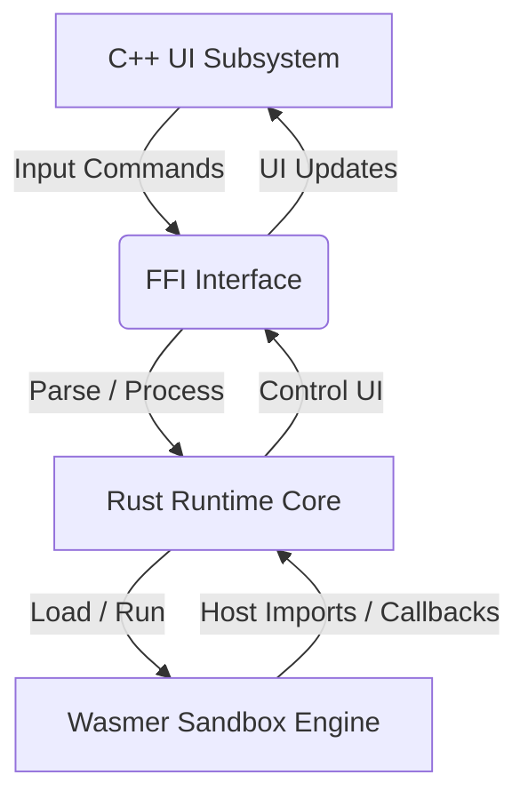

# plug

[](https://github.com/PlugFrameWork/plug/actions/workflows/ci.yml)
[](LICENSE)

**plug** is a highly efficient, modular, and cross-platform native host environment designed for running sandboxed WebAssembly (WASM) plugins. The host leverages a high-performance C++ front-end for windowing, user interface rendering, and OS integration, while delegates all command parsing, runtime execution, and WASM sandboxing to a Rust-powered backend built on the **Wasmer** engine.


---

## Key Features

- **Hybrid Architecture**: C++ UI layer coupled with a Rust command processor via FFI.
- **WASM Sandboxing**: Secure, isolated plugin execution utilizing Wasmer and Cranelift.
- **Cross-Platform**: Tailored code paths for Windows (Win32 APIs) and Linux (X11/GTK/POSIX).
- **Interactive UI**: Multitab interface with support for carets, scrollbars, text selections, and hover animations.
- **Permissions Control**: Granular permissions system to restrict WASM plugins' access to the host file system, networks, and commands execution.

---

## Architecture Overview



- **C++ UI Host**: Initializes system contexts, renders the multitab layout, registers input hooks, and updates visual frames.
- **Rust Runtime (`tm_main`)**: Coordinates commands execution, handles plugins repository connections, caches state, and instantiates the Wasmer engine.
- **Plugins**: Compiled WebAssembly modules (`wasm32-unknown-unknown`) obeying the host import specifications.

---

## Getting Started

### Prerequisites

To build and run plug, make sure you have the following toolchains installed:

- **Rust**: 1.70 or newer (with `wasm32-unknown-unknown` target)
- **Python**: 3.8 or newer (for build scripts)
- **CMake**: 3.20 or newer
- **Ninja**: Required for the build runner
- **C++ Compiler**:
  - **Windows**: MSVC v143 (Visual Studio 2022) or Clang-cl
  - **Linux**: GCC or Clang (with `pthread` and standard X11/GTK developer packages)

### Quick Build

Use the platform-specific scripts to compile both the Rust library, plugins, and C++ executable:

#### Windows
```powershell
# Run the bat wrapper script
cd plug.cross\windows
.\make.bat
```

#### Linux
```bash
# Run the shell wrapper script
cd plug.cross/linux
./make.sh
```

Compiled binaries will be generated inside the `release/` folder at the root of the project.

---

## Interactive Command Line

Once running, plug starts a shell-like command session. The commands supported by the console are:

| Command | Args | Description |
|---|---|---|
| `/?` | None | Displays the help text menu. |
| `/a` | None | Displays about information, environment details, and system specs. |
| `/tab` | None | Creates a new active tab in the shell window. |
| `/plug*` | None | Fetches the online plug repository and lists active/available plugins with session hashes. |
| `/plug` | `[hash]` | Installs and loads the selected WASM plugin into the context using its session hash. |
| `/plug-` | `[hash]` | Unloads and removes the specified plugin. |
| `/e` | None | Closes the message loop and exits the application. |

### Sub-Shell Plugins (`pTerm`)
`pTerm` is the default official terminal plugin. You can open sub-shells inside tabs by running:
- `/cmd` - Spawns a Command Prompt terminal context inside the current tab.
- `/ps` - Spawns a PowerShell terminal context inside the current tab.

Once loaded, you can type commands directly in the window, and they will be run by the sandboxed plugin under the `host_exec` security permission.

---

## Writing a Plugin

Plugins are Rust crates compiled to `.wasm`. A basic plugin requires importing the host interfaces:

```rust
extern "C" {
    fn get_args(ptr: *mut u8, max_len: usize);
    fn print_info(ptr: *const u8, len: usize);
}

#[no_mangle]
pub extern "C" fn run() {
    let mut buf = [0u8; 128];
    unsafe { get_args(buf.as_mut_ptr(), buf.len()); }
    
    // Process arguments and print to the host console
    let message = "Hello from WASM plugin!";
    unsafe { print_info(message.as_ptr(), message.len()); }
}
```

Refer to the [Plugin Development Guide](docs/PLUGIN_DEVELOPMENT.md) for more details.

---

## Directory Structure

```
plug/
├── docs/                # Technical documentation (Architecture, API, Build guides)
├── plug.app/            # Main application source code
│   ├── cmn/             # Common C/C++ header files
│   ├── src/             # OS-specific interface logic (C++ / UI layouts)
│   │   ├── linux/       # Linux GTK/X11 rendering loops
│   │   └── windows/     # Windows Win32 rendering loops
│   │
│   ├── srv/             # C administrative utilities
│   └── rt/              # Rust runtime core (Wasmer integrations & commands parser)
│
├── plug.cross/          # Cross-platform CMake files and Python builders
├── plug.res/            # Asset files (Icons, Screenshots)
├── plugins/             # Unified manifest and compiled WASM plugins cache
└── tests/               # Unit and integration test runners
```

---

## License

This project is licensed under the MIT License - see the [LICENSE](LICENSE) file for details.
Assets inside `plug.res/` are licensed under [CC BY-NC-ND 4.0](https://creativecommons.org/licenses/by-nc-nd/4.0/).
