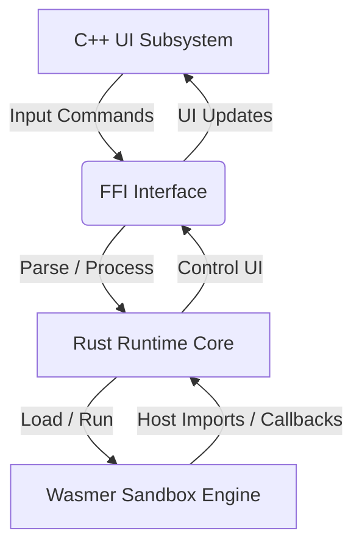

# Plug: A WebAssembly Plugin Framework

<p align="left">
  
</p>

<p align="center">
  <a href="https://github.com/PlugFrameWork/plug/actions/workflows/ci.yml"></a>
  <a href="LICENSE"></a>
</p>

## Features

- **Sandboxed WASM Runtime**: Isolated memory execution using Wasmer 4.3 (Cranelift). WASI preview1 imports are explicitly allowlisted — only a safe subset of 48 syscalls exposed; dangerous ones (filesystem, network, process) blocked.
- **Granular Permissions Model**: Enforces manifest-declared permissions at load time (import validation) AND call time (runtime gate) for ALL host imports including `host_get_platform`. WASI imports blocked unless in explicit allowlist.
- **Supply Chain Integrity**: Plugin registry (`pluglists.json`) verified via minisign/Ed25519 signature before any content trusted.
- **SSRF Protection**: `net_post` enforces HTTPS-only, blocks private/reserved IPs (RFC1918, loopback, link-local), limits response to 1 MiB.
- **Path Containment**: `cd` command restricted to current working directory jail; traversal escapes blocked.
- **Multitab Desktop Shell**: Launch and run multiple independent plugins concurrently in separate workspace tabs.
- **Cross-Platform Native UI**: Compiles to Windows (Win32 GDI) and Linux (GTK4) with zero browser engine footprint.

---

## Overview



---

## Getting Started

Refer to [docs/BUILD.md](docs/BUILD.md) for full toolchain setup.

### Quick Build
```bash
# Windows
cd plug.cross\windows && .\make.bat

# Linux
cd plug.cross/linux && ./make.sh
```

---

## Console Commands

| Command | Args | Description |
|---|---|---|
| `/?` | None | Displays help details. |
| `/a` | None | Displays system environment and memory statistics. |
| `/tab` | None | Spawns a new workspace tab. |
| `/cmd` | `[query]` | Spawns a Windows Command Prompt tab or executes a CMD query. |
| `/ps` | `[query]` | Spawns a Windows PowerShell tab or executes a PowerShell query. |
| `/sh` | `[query]` | Spawns a Linux shell tab or executes a shell query. |
| `/plug*` | None | Lists available online registry plugins and hashes. |
| `/plug` | `[hash]` | Downloads and initializes a plugin. |
| `/plug-` | `[hash]` | Unloads the specified plugin. |
| `/e` | None | Exits the application. |

---

## Plugin Development

Plugins are compiled targeting `wasm32-unknown-unknown`.

```rust
extern "C" {
    fn get_args(ptr: *mut u8, max_len: usize);
    fn print_info(ptr: *const u8, len: usize);
}

#[no_mangle]
pub extern "C" fn run() {
    let mut buf = [0u8; 128];
    unsafe { get_args(buf.as_mut_ptr(), buf.len()); }
    let msg = "Hello from WASM plugin!";
    unsafe { print_info(msg.as_ptr(), msg.len()); }
}
```

Refer to [docs/PLUGIN_DEVELOPMENT.md](docs/PLUGIN_DEVELOPMENT.md) for details on permissions configuration (`plugin.toml`) and FFI imports.

---

## Security Architecture

See [docs/security.md](docs/security.md) for the complete threat model, sandbox architecture, and security controls summary.

### Key Guarantees
- **No shell invocation** — `host_exec` uses direct `execvp`/`CreateProcess`
- **Allowlist-only execution** — manifest `allowed_commands` with canonical path + args regex
- **WASI allowlist** — only 48 safe syscalls exposed; `path_open`, `sock_connect`, `proc_raise` etc. blocked
- **Registry signature verification** — minisign/Ed25519 baked pubkey
- **SSRF defense** — HTTPS only, private IP blocking, response size limit
- **Input bounds** — all FFI string reads capped (64 KiB general, 2 KiB URL, 16 KiB JSON, 1 MiB response)
