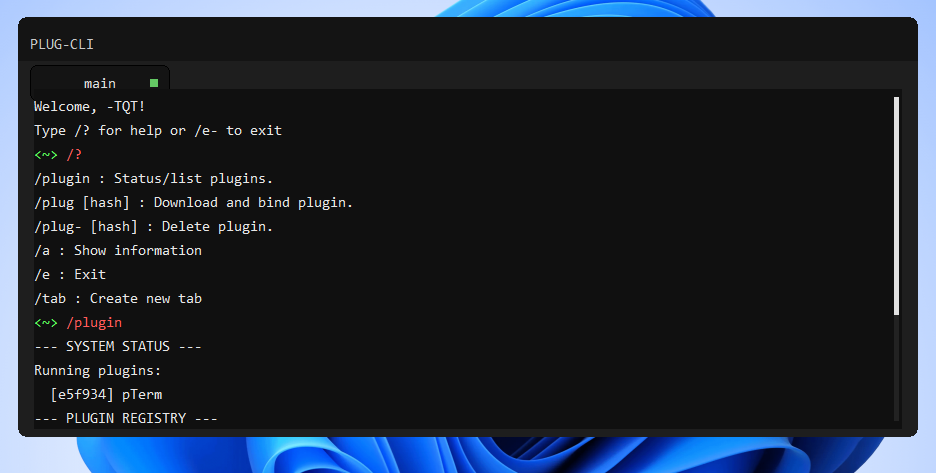
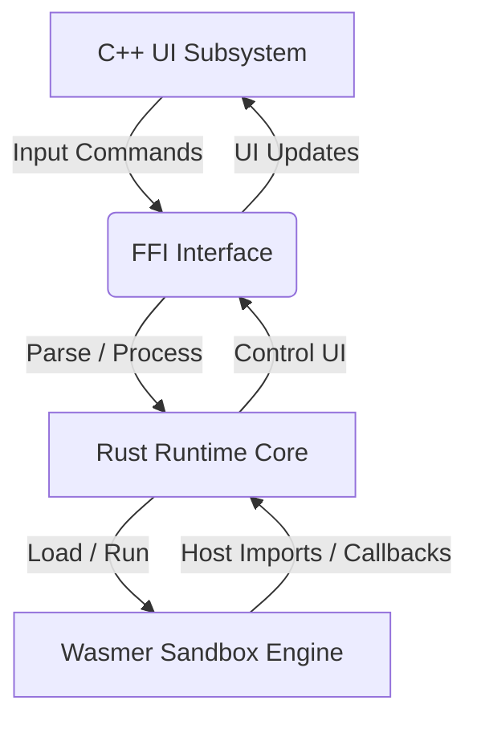

<p align="center">
  
</p>

<p align="center">
  <a href="https://github.com/PlugFrameWork/plug/actions/workflows/ci.yml"></a>
  <a href="LICENSE"></a>
</p>



**Plug** is a lightweight, cross-platform host Framework that helps run sandboxed WebAssembly (WASM) plugins inside native multitab window interfaces.

---

## Features

- **Sandboxed WASM Execution**: Run plugins in secure, isolated containers using the Wasmer JIT compiler.
- **Granular Permissions Model**: Limit plugin capabilities (e.g., file system access or host execution) via manifest declarations.
- **Multitab Desktop Shell**: Launch and run multiple independent plugins concurrently in separate workspace tabs.
- **Online Plugin Registry**: Fetch, verify, and load remote plugins dynamically using session hashes.
- **Cross-Platform Native UI**: Compiles to Windows (Win32) and Linux (GTK4) with zero browser engine footprint.

---

## Overview



---

## Getting Started

Refer to [docs/BUILD.md](docs/BUILD.md) for full toolchain setup.

### Quick Build
```bash
# Windows
cd plug.cross\windows && .\make.bat

# Linux
cd plug.cross/linux && ./make.sh
```

---

## Console Commands

| Command | Args | Description |
|---|---|---|
| `/?` | None | Displays help details. |
| `/a` | None | Displays system environment and memory statistics. |
| `/tab` | None | Spawns a new workspace tab. |
| `/plug*` | None | Lists available online registry plugins and hashes. |
| `/plug` | `[hash]` | Downloads and initializes a plugin. |
| `/plug-` | `[hash]` | Unloads the specified plugin. |
| `/e` | None | Exits the application. |

---

## Plugin Development

Plugins are compiled targeting `wasm32-unknown-unknown`.

```rust
extern "C" {
    fn get_args(ptr: *mut u8, max_len: usize);
    fn print_info(ptr: *const u8, len: usize);
}

#[no_mangle]
pub extern "C" fn run() {
    let mut buf = [0u8; 128];
    unsafe { get_args(buf.as_mut_ptr(), buf.len()); }
    let msg = "Hello from WASM plugin!";
    unsafe { print_info(msg.as_ptr(), msg.len()); }
}
```

Refer to [docs/PLUGIN_DEVELOPMENT.md](docs/PLUGIN_DEVELOPMENT.md) for details on permissions configuration (`plugin.toml`) and FFI imports.